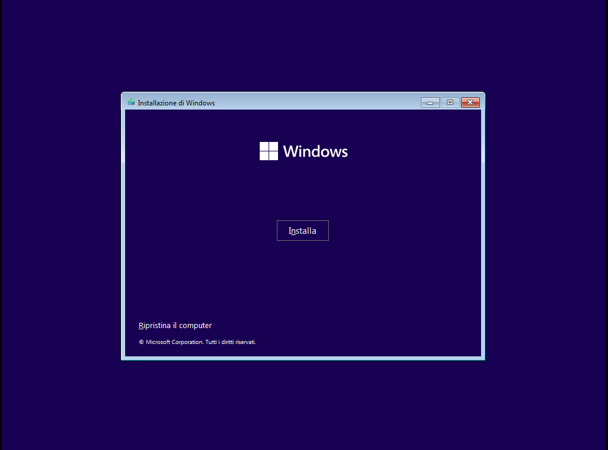
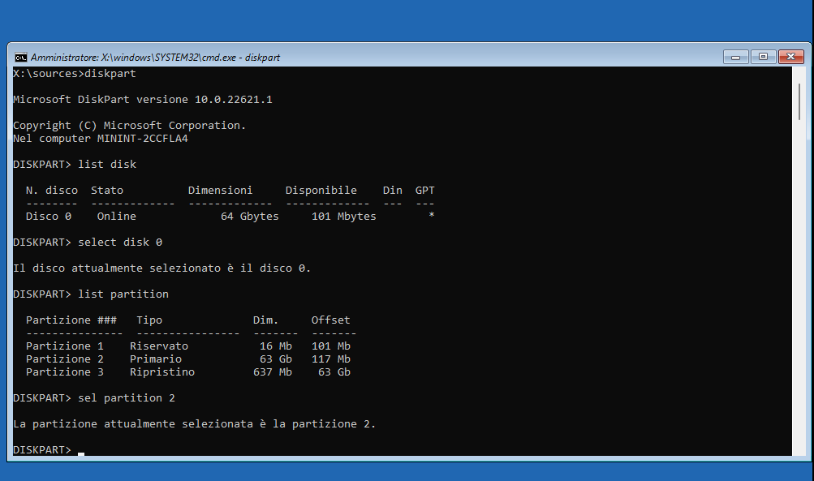

# ResetEFI in Windows 10/11
Un semplice modo per ricreare la partizione EFI nel tuo PC Windows cancellata per errore!

Se anche tu hai cancellato per errore la partizione EFI di Windows dal tuo PC e quindi non viene mostrata l'opzione Windows Boot Manager nel BIOS e all'avvio del pc viene mostrata la scritta NO BOOTABLE DEVICE o simili, sei al posto giusto per ricrerae la partizione **SENZA LA PERDITA DI ALCUN DATO** e senza l'utilizzo di Software di Terze Parti.

## Procedimento
Per prima cosa, occorre una chiavetta sulla quale bootare la ISO di Windows 11 (o di Windows 10). Per farlo scarica la ISO dal [sito di Microsoft](https://www.microsoft.com/it-it/software-download/windows11) e crea una USB avviabile con [Rufus](https://rufus.ie/it/) o [Ventoy](https://www.ventoy.net/en/download.html). Una volta creata la USB avviabile procedi al prossimo passaggio.

Inserisci la USB al'interno del PC e avviala tramite il Boot Manager premendo il tasto previsto dalla tua scheda madre (se non sono connessi altri dispositivi o le USB sono impostate come Boot Priority, si avvierà il contenuto della USB in automatico).

Alla prima schermata premi Shift+10 per accedere al cmd, non temere, non sarà nulla di complicato. In alternativa puoi selezionare avanti nella prima schermata e poi Ripristina il computer nella schermata successiva, per poi aprire il Prompt dei Comandi (cmd).

Una volta raggiunto il cmd esegui i seguenti comandi:
  + **diskpart** per avviare il software Diskpart
  + **list disk** per visualizzare i dischi consessi al dispositivo
  + **select disk** dopo select disk scrivere il numero corrispondente all'unità (es: select disk 0)
  + **list partition** per visualizzare le partizioni del disco selezionato. Qui si può notare se effettivamente la partizione EFI manca oppure no. In caso ci fosse, non proseguire con il tutorial in quanto non risolverà il tuo problema.
  + **select partition** dopo select partition scrivere il numero corrispondente alla partizione da ridurre (es select partition 0)
  
  + **shrink desired=100** preleva da quella partizione 100MB da utilizzare per la partizione EFI
  + **create partition efi size=100** per creare effettivamente la partizione nei 100MB liberati in precedenza
  + **format quick fs=fat32** per formattarla nel formato corretto
  + **assign letter=G** per assegnarle una lettera, non deve essere per forza G ma non deve essere una lettera già in uso da altre partizioni
  + **exit** per uscire da Diskpart
    
  + **bcdboot C:\Windows /s G** dove C è la lettera della partizione di sistema, se il tuo sistema utilizza un'altra lettera, utilizza quella al posto di C. Questo comando copierà i file di avvio di Windows conteuti nel disco C all'interno della partizione EFI
  + **exit** per uscire dal cmd
  + riavvia il computer

Se hai svolto la procedura correttamente, il tuo PC dovrebbe avviarsi normalmente nel tuo Sistema Operativo, come se non fosse accaduto nulla. Congratulazioni!
